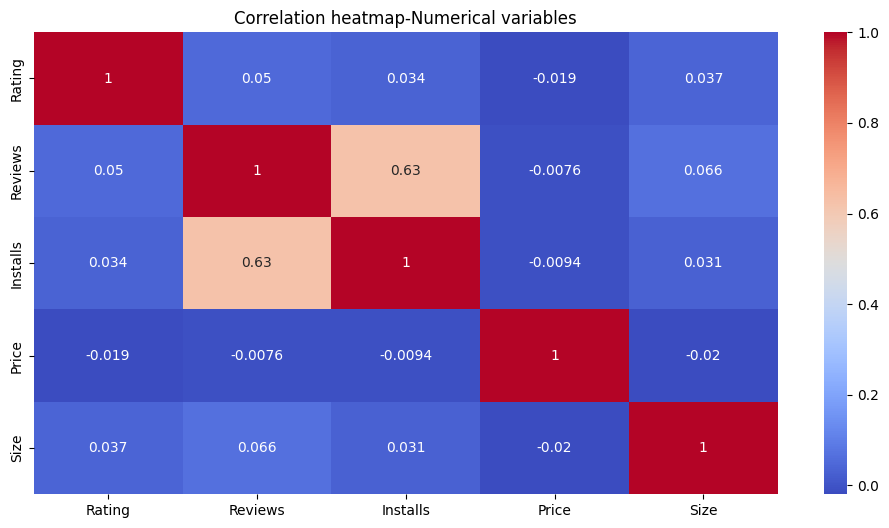
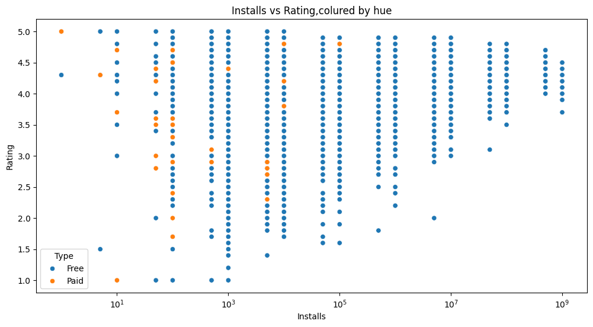

# Play Store App Review Analysis

## Overview
An exploratory data analysis (EDA) project analyzing Google Play Store app metadata and user reviews to understand what drives app ratings, installs, pricing outcomes, and user sentiment. The goal is to turn raw app store data into practical, data-backed recommendations for developers and product teams around category positioning, pricing strategy, and user experience.

## Problem Statement
The Play Store hosts millions of apps, but success is unevenly distributed. This project investigates whether category, pricing, app size, or user sentiment actually drive app performance — and whether star ratings alone are a reliable signal of quality.

## Business Objective
Help app developers and product teams make data-driven decisions on:
- Category positioning — which categories offer real opportunity vs heavy competition
- Pricing strategy — does Free vs Paid affect ratings or adoption
- Rating validation — do star ratings reflect actual user sentiment, or hide issues

## Dataset
- **Play Store Data** — 10,841 rows, 13 columns (category, rating, installs, price, size, content rating, etc.)
- **User Reviews** — 64,295 rows, 5 columns (review text, sentiment, polarity, subjectivity)
- Source: [Google Play Store Apps — Kaggle](https://www.kaggle.com/datasets/lava18/google-play-store-apps)

## Data Cleaning
- Removed a corrupted row (scraping error, shifted columns)
- Removed duplicates (483 exact + repeated app names in app data; 33,616 in reviews)
- Converted Reviews, Installs, Price, and Size from text to numeric types
- Filled missing Rating and Size values using median (robust to outliers)
- Engineered a `Days_Since_Update` feature
- Merged both datasets on the App column for cross-dataset sentiment analysis

## Methodology
Followed the **UBM framework** — Univariate, Bivariate, and Multivariate analysis — producing **20 charts**, each with a structured insight: why the chart was chosen, what it revealed, and its business impact (positive or negative).

## Sample Visualizations

### Correlation Heatmap


Rating shows near-zero correlation with Reviews, Installs, Price, or Size — only Reviews and Installs show a meaningful relationship (0.625), meaning none of these structural factors reliably predict app quality.

### Installs vs Rating by Type


Paid apps cluster almost entirely in lower install ranges, while Free apps span the entire range — including the billion-install tier. Mass-scale adoption is achievable only through a Free pricing model.

## Key Findings
- Pricing model has almost no effect on ratings or sentiment, but only Free apps reach mass-scale adoption (100M+ installs)
- SOCIAL category has few apps but massive average installs, skewed by a handful of giants (Facebook, Instagram, WhatsApp)
- Star ratings show near-zero correlation with Reviews, Installs, Price, or Size — review sentiment matters more
- GAME users show polarized sentiment (strong positive and negative), while MEDICAL/PERSONALIZATION show steadier satisfaction and higher willingness to pay
- Only ~0.2% of apps ever reach 1 billion installs

## Tools
Python, Pandas, NumPy, Matplotlib, Seaborn — in Google Colab

## How to Run
1. Download the dataset from Kaggle: [Google Play Store Apps](https://www.kaggle.com/datasets/lava18/google-play-store-apps)
   - You'll need `googleplaystore.csv` (Play Store Data) and `googleplaystore_user_reviews.csv` (User Reviews)
2. 2. Clone this repo and install dependencies:
```bash
   git clone https://github.com/Dhanush086/Playstore-app-review-analysis.git
   cd Playstore-app-review-analysis
   pip install -r requirements.txt
```
3. Place the CSV files in the same directory as the notebook (or update the file paths in the first cell)
4. Open `PlayStore_App_Review_AnalysisEDA_project.ipynb` in Jupyter or Google Colab and run all cells

**Environment:** Python 3.10+, tested in Google Colab


## Author
[Dhanush/08](https://github.com/Dhanush086)
